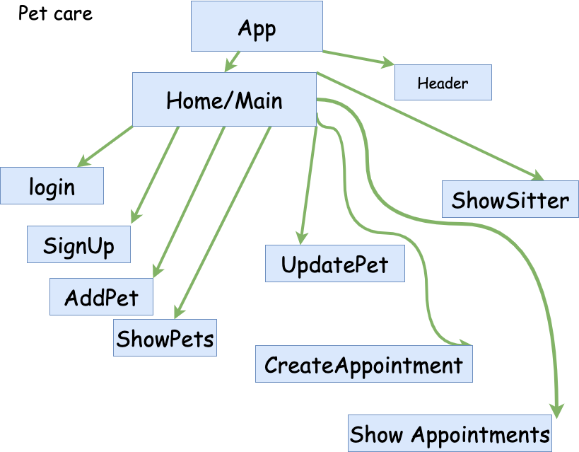
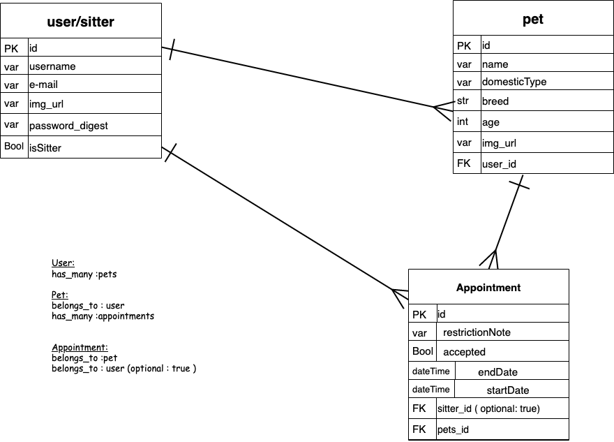

# PetCare
- [Overview](#overview)
- [MVP](#mvp)
  - [Goals](#goals)
  - [Libraries](#libraries)
  - [Client (Front End)](#client-front-end)
    - [Wireframes](#wireframes)
    - [Component Tree](#component-tree)
    - [Component Hierarchy](#component-hierarchy)
    - [Component Breakdown](#component-breakdown)
    - [Tasks Estimates](#tasks-estimates)
  - [Server (Back End)](#server-back-end)
    - [ERD Model](#erd-model)
- [Post-MVP](#post-mvp)
- [Code Showcase](#code-showcase)
- [Code Issues & Resolutions](#code-issues--resolutions)

<br>

## Overview

**PetCare** This is an app for pet owners that need a babysitter for there pets. Basically in this app you are able to book an appointment to any PetCarer that is available and once is book you are all set. In this app you are able to add all your pets that need a sitter. Also you can checkout our database of all our sitters with basic information that you might find handy for contact.

<br>

## MVP
Well for my MVP I want to be able to buil a full stack project with CRUD in the front end and back using rails. 
<br>

### Goals

- Complete Full back end authentication
- Complete Full CRUD in the back end using Rails
- Complete Full CRUD on the front end using React
- Be able to Use FlexBox
- Have authentication on the front end

<br>

### Libraries

> Use this section to list all supporting libraries and dependencies, and their role in the project.

|     Library      | Description                                |
| :--------------: | :----------------------------------------- |
|      React       |This will allow me to use JS and HTML to render my API calls|
|   Ruby on Rails | This is what I be will using to build in my backEnd/api calls|


<br>

### Client (Front End)

#### Wireframes

> Here is my Front end wireframes using Adobe XD

[Front End](https://xd.adobe.com/view/600e46bf-3ee2-4fb4-7ef7-983be3634f53-163f/)


#### Component Tree

> Here is my diagram tree using Diagrams.net 




#### Component Hierarchy

> My Repo Structure :

``` structure

PetCare
|__ app/
      |__ channels/
      |__ controllers/
      |__ jobs/
      |__ mailers
      |__ models
      |__ views
|__ bin/
|__ client/
      |__ public/
      |__ src/
|__ config/ 
      |__ initializers/     
                    |__ cors.rb   
      |__ routes.rb       
|__ db/ 
      |__ migrate/     
      |__ schema.rb     
      |__ seeds.rb     
|__ lib/      
|__ log/      
|__ public/      
|__ storage/      
|__ test/      
|__ tmp/      
|__ .gitignore      
|__ .ruby-version     
|__ Gemfile     
|__ Gemfile     
|__ Rakefile     
|__ README.md    


```

#### Component Breakdown

|  Component   |    Type    | state | props | Description                                                      |
| :----------: | :--------: | :---: | :---: | :--------------------------------------------------------------- |
|    App    | Class |   y   |   y   | This is where the app is going to render state and have all the api calls|
|  Main  | functional |   n   |   n   | This will just render the headers and all the routes and components|
|   Header   |   functional   |   n   |   n   | This will just be in charge of all the header navigational layout for the user|
| login | class |   y  |   y   | This is a form that will handle when a user logs in|
|    SignUP    | class |   y   |   y   | This will handle the new users for the app |
|    AddPet    | class |   y   |   y   | This will handle when a user adds a new pet |
|    ShowPets    | functional |   n  |   n   | Just render all the users pets |
|    UpdatePets    | class |   y  |   y   | This will updated the users pets if needed |
|    Create an Appointment    | class |   y  |   y   | This is a form to set up an appointment |
|    ShowSitters   | functional |   n  |   n   | Just render all the sitters in our system |

#### Tasks Estimates

| Task | Priority | Estimated Time | Time Invested | Actual Time |
| --- | :---: |  :---: | :---: | :---: |
| Start Rails installation| L | 1hr| |  |
| Start USER Model/schema migrations | H | 2hr||  |
| USER controllers setUp with routes | H | 2hr |  |  |
| USER Authentication | H | 4hr | | |
| Add the rest of the Migration/Models for my Tables | M | 4hr | |  |
| Add the controllers and routes for the rest fo the models| H | 3hr |  | |
| Check if everything is done with Backend using rails console and postico| H | 3hr |  | |
| Start installing for front End| H | 2hrs |  | |
| Start Changing index and app.js| H | 2 hr | |  |
| Working on App.js| H | 2hr |  | |
| Working on Header| H | 2hr |  | |
| Work on Main and set up routes| M | 1hr | | |
| Work on Login| H | 3hr |  |  |
| Work on Sign Up| H | 3hr |  |  |
| Work on AddPet| H | 3hr |  |  |
| Work on ShowPets| H | 3hr |  |  |
| Work on UpdatePet| H | 3hr |  |  |
| Work on Create an Appointment| H | 3hr |  |  |
| Work on Create an ShowSitter| H | 3hr |  |  |
| Work on CSS| H | 20hr |  |  |
| Total | H | 69hrs| TBD | TBD|


<br>

### Server (Back End)

#### ERD Model

> My ERD using Diagrams.net



<br>

***

## Post-MVP

- Be Able to add a login for the the sitters
- Be able to add a calender so it can be easier for the usr to choose a date
- Be able facilitate more appoitnmet form
- have a search component to search the sitters
- Add a showSitterDetail component so that the user can see and click a button to add them to her favorites
***

## Code Showcase

> Use this section to include a brief code snippet of functionality that you are proud of and a brief description. None at the moment

## Code Issues & Resolutions

> Use this section to list of all major issues encountered and their resolution, if you'd like. None at the moment
